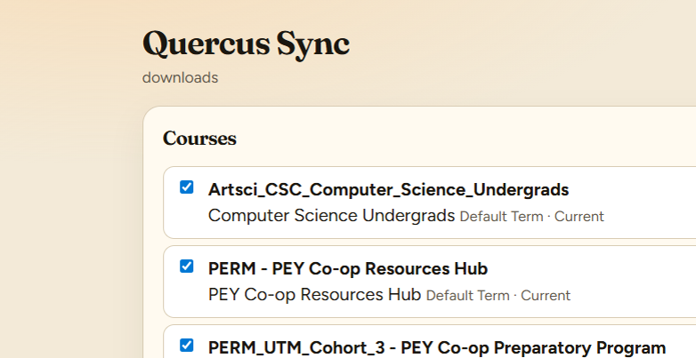
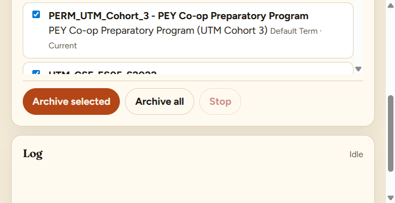

# Quercus Sync

A local archive of **your** University of Toronto Mississauga courses on [Quercus](https://q.utoronto.ca). Put a Canvas access token in `.env`, then pick courses in the UI.



The token is a student credential from Account → Settings → New Access Token. It has the same access as the website. Locked or date-restricted courses are skipped. Quiz questions are not fetched.



## Setup

Python 3.11+. Copy the example env file and paste your token — the web UI does not take one.

```powershell
copy .env.example .env
```

Edit `.env`:

```
QUERCUS_CANVAS_URL=https://q.utoronto.ca
QUERCUS_TOKEN=paste-your-token-here
QUERCUS_DOWNLOAD_DIR=downloads
```

Create the token while signed in at [q.utoronto.ca](https://q.utoronto.ca): **Account → Settings → New Access Token**. Do not commit `.env`.

Then:

```powershell
python -m venv .venv
.\.venv\Scripts\activate
pip install -e ".[dev]"
python -m quercus_sync
```

Open [http://127.0.0.1:43147](http://127.0.0.1:43147). Tick courses, **Archive selected** or **Archive all**. **Stop** ends a run after the current file. Files land under `downloads/{term}/{course}/`. Restart the app after you change `.env`.

macOS / Linux:

```bash
cp .env.example .env
python3 -m venv .venv
source .venv/bin/activate
pip install -e ".[dev]"
python -m quercus_sync
```

With no token, the app uses a built-in demo campus so you can try the layout.

```bash
quercus-sync sync --demo
```

## What it downloads

From every course your token can still open (this term and concluded terms that are not date-locked):

- Course files (and files linked from pages, modules, and assignments)
- Module outlines, wiki pages, assignment descriptions, announcements, syllabus
- Discussions, quiz instructions (not questions), calendar events

Incremental runs skip files whose size already matches.

## Folder layout

```
downloads/
  Fall 2025/
    CSC148H5 F — Introduction to Computer Science/
      Files/Lectures/Week 01 — Python recap.pdf
      Modules/01 Week 1 — Getting oriented/module.md
      Pages/Welcome & how this course runs.html
      Assignments/Lab 2 — Recursion.html
      Announcements/2025-09-18 Lab rooms this Friday.html
      Syllabus.html
      _manifest.json
```

## How it talks to Quercus

Quercus is Canvas. Requests send `Authorization: Bearer <token>` to `/api/v1/...`. If a file is locked or the course is past its access date, the API returns 403 — same as the site.

```
GET /api/v1/users/self
GET /api/v1/courses?enrollment_state[]=active&enrollment_state[]=completed
GET /api/v1/courses/:id/files
GET /api/v1/files/:id
GET /api/v1/courses/:id/modules?include[]=items
```

Official reference: [Canvas LMS API](https://canvas.instructure.com/doc/api/).

## Other Canvas schools

Set `QUERCUS_CANVAS_URL` in `.env` to your instance. The API is the same.

## Limits

- Personal study copy of courses **you** can already open. Do not redistribute lecture PDFs or publisher packs.
- Quercus remains the source of truth for due dates and submissions.
- The client backs off on HTTP 429.

## Development

```bash
pytest
```
